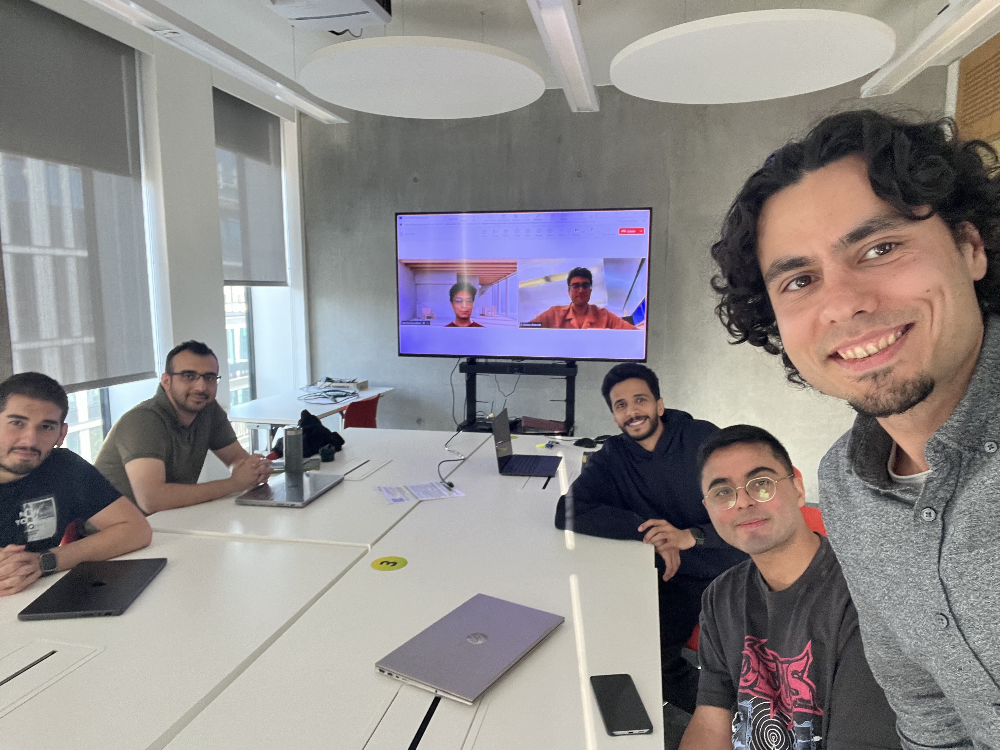

<h2>Turullab</h2>

Rules:

<ol class="turullab-rules">
  <li>Turullab is not Trollab</li>
  <li>Turullab is <strong>NOT</strong> Trollab</li>
  <li>Turullab does not exist. We are a subset of the <a href="https://smash.inf.ed.ac.uk">SMASH</a> group</li>
</ol>

  

<h2 id="team">Team</h2>

<ul>

  <li><a href="{{ member.url }}">{{ member.name }}</a> ({{ member.role }})</li>

</ul>

<h2 id="alumni">Alumni</h2>

<ul>

  <li>{{ person.name }} ({{ person.role }})</li>

</ul>

<h2>Projects</h2>

  <i class="fas fa-shield-halved"></i>

Misinformation &amp; Deepfakes

  We study how false and misleading content spreads on social media — from coordinated inauthentic behaviour and state censorship to AI-generated deepfakes and synthetic media. We build detection methods and characterize the impact of these threats on public discourse.

<ul class="project-card__papers">
  <li><a href="https://arxiv.org/abs/2508.13375">State &amp; Geopolitical Censorship on Twitter (X) — CIKM 2025</a></li>
  <li><a href="https://arxiv.org/abs/2010.10600">Misleading Repurposing on Twitter — ICWSM 2023</a></li>
  <li><a href="https://arxiv.org/pdf/1910.07783.pdf">Ephemeral Astroturfing Attacks — Euro S&amp;P 2021</a></li>
  <li><a href="https://arxiv.org/abs/2105.13398">Tactical Reframing of Disinformation Campaigns — ICWSM 2021</a></li>
</ul>

  <i class="fas fa-robot"></i>

Human–AI Interaction

  We study how people interact with AI assistants in high-stakes and sensitive domains — from romantic relationships and mental health support to legal and medical advice. A central question is how LLMs handle disagreement: when they defer, push back, or subtly steer a user's views. This connects to broader questions of epistemic authority — how AI systems shape what people believe, how they reason, and whom they trust.

🏆 Awarded UoE Generative AI Lab Funding: £2,500

Papers coming soon

  <i class="fas fa-chart-network"></i>

Computational Social Science

  We apply computational methods to understand large-scale social phenomena — including cross-partisan dynamics, political discourse across platforms, gender in online communication, and the methodological challenges of studying social media data.

<ul class="project-card__papers">
  <li><a href="https://arxiv.org/abs/2603.23027">Gendered Communication of Political Elites on Truth Social — WebSci 2026</a></li>
  <li><a href="https://arxiv.org/abs/2603.17901">Grievance Politics vs. Policy Debates — ICWSM 2026</a></li>
  <li><a href="https://arxiv.org/abs/2504.09376">Cross-Partisan Interactions on Social Media — ICWSM 2025</a></li>
  <li><a href="https://arxiv.org/pdf/2303.00902">The Impact of Data Persistence Bias — WebSci 2023</a></li>
</ul>

  <i class="fas fa-flask"></i>

Automating Science &amp; Education

  We explore how LLMs and multi-agent AI systems can accelerate scientific workflows and transform education — from automated opinion mining and structured election analysis to orchestrating agent collaborations that produce full data science research papers end-to-end. We are also building AI-assisted teaching tools and studying the epistemic implications of delegating scientific reasoning to generative models.

<ul class="project-card__papers">
  <li><a href="https://arxiv.org/abs/2304.03434">Opinion Mining from YouTube Captions Using ChatGPT — arXiv 2023</a></li>
</ul>

More papers coming soon

